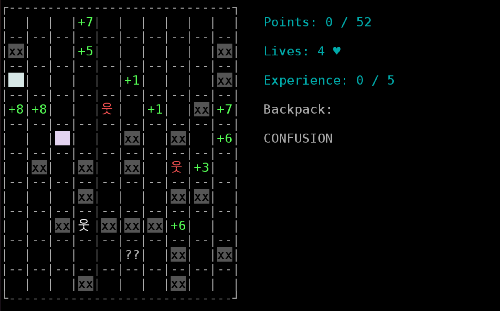

# Roguelike

### Документация

Документация,  а также правила игры
находятся [по ссылке](https://github.com/Soykaa/Roguelike/blob/task-02-game-imlementation/architecture/ARCHITECTURE.md).

### Тестирование и запуск

1. Выкачать нужную ветку репозитория:

   `git clone --single-branch --branch task-02-game-imlementation https://github.com/Soykaa/Roguelike`


2. Зайти в папку: `Roguelike`


3. Для запуска тестов ввести команду:
   `./gradlew test`

   Если вывелась надпись `BUILD SUCCESSFUL`, значит все тесты прошли, иначе выведется название упавшего теста


4. Для запуска приложения ввести следующие команды:

   `./gradlew assemble`

   `java -jar build/libs/*.jar [directory_path]`, где `directory_path` - путь до директории, в которой лежат файлы для генерации уровней (параметр опциональный)

### Скриншоты


### Формат файлов для генерации уровней

````
{
  "victoryPoints": <victory_points>, 
  "realShelterType": <shelter_type>,
  "board": [[<character_11>, ..., <character_1n>], 
            ..., 
            [<character_m1>, ..., <character_1n>]]
}

````

`victory_points` - количество очков, которое нужно набрать, чтобы пройти уровень

`chelter_type` - тип убежища, которое действует на данном уровне

`board` - игровое поле, задается как двумерный массив json представлений класса `GameCharacter`. 
Длины всех массивов, отвечающих за строчку поля, должны быть одинаковыми

`character_ij` - объект, который стоит в клетке с координатами i, j. Ниже представлен формат задания данных объектов для всех типов:

- `Points`:

````
{
  "numberOfPoints": <number_of_points>,
  "characterType": "POINTS"
}
````
`number_of_points` - количество очков на данном уровне

- `Obstacle`:

````
{
  "destroyBonus": <destroy_bonus>,
  "characterType": "OBSTACLE"
}
````
`destroy_bonus` - увеличение очков за разрушение препятствия

- `Inventory`:

````
{
  "type": <inventory_type>,
  "characterType":"INVENTORY"
}
````
`inventory_type` - _PROTECTION_ для уменьшения урона врагов или _DESTROY_ для разрушения препятствий
 
- `Shelter`:

````
{
  "characterType": <shelter_type>
}
````
`shelter_type` - тип убежища, _SHELTER_LAVENDER_, _SHELTER_YELLOW_ или _SHELTER_PINK_

- `EnemyStrong`:

````
{
  "characterType":"ENEMY_STRONG"
}
````
- `EnemyWeak`:

````
{
  "maxSteps": <max_step>,
  "shift": {
    "x": <shift_x>,
    "y": <shift_y>
  },
  "characterType": "ENEMY_WEAK"
}
````
`max_step` - максимальное количество шагов в одну сторону, которое может сделать враг

`shift_x, shift_y` - сдвиг по осям за один шаг
- `Player`:

````
{
  "lives": <lives>,
  "points": <points>,
  "currentCoordinates": {
    "x": <player_x>,
    "y": <player_y>
  },
  "characterType": "PLAYER"
}
````
`lives` - жизни игрока

`points` - изначальное количество очков игрока

`player_x, player_y` - координаты игрока на поле
- `Empty`:

````
{
  "characterType": "EMPTY"
}
````
