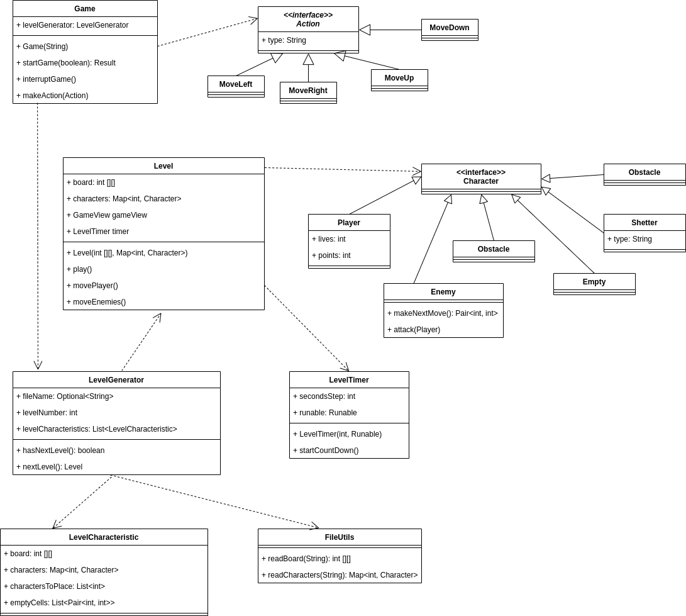

# Design document

## Список разработчиков

- Жемчужина Елизавета
- Кириллова Евгения
- Сунко Елена
- Иценко Екатерина

## Общие сведения о системе
### Назначение

Система представляет из себя реализацию roguelike игры **Escape** с консольной графикой. Система предназначена для развлечения и отдыха.

### Границы системы
- Поддерживается только однопользовательский оффлайн режим игры
- Консольная графика
- Управление производится с клавиатуры заранее заданными клавишами
- Предусмотрено главное меню с тремя опциями:

  - Начать игру (_play_)
  - Выйти из игры (_exit_)
  - Посмотреть подсказки по управлению (_help_)
- Текущая локация (или поле) представляет из себя прямоугольное поле в декартовой системе координат
- Текущее поле отображается на экране целиком
- На начальном этапе случайно генерируется расположение ресурсов и препятствий для отдельных уровней
- Помимо игрового поля на экране отображаются панели с ресурсами, здоровьем и инвентарем 
- Отсутствуют контрольные точки (сохранения)

### Контекст

- Приложение не поддерживает взаимодействие с сервером
- Приложение адаптировано под Linux, MacOS и Windows

## Architectural drivers
### Технические ограничения
Должна быть предусмотрена библиотека для работы с консолью, работающая под упомянутыми операционными системами.

### Бизнес-ограничения

- Срок разработки ограничен несколькими месяцами
- В силу отсутствия бюджета, используются бесплатные фреймворки и библиотеки

### Качественные характеристики системы

- Система должна быть достаточно гибкой для дальнейшей расширяемости, то есть необходимость в изменении установленных границ при добавлении или модификации сущностей отсутствует. Например, должна быть возможность добавления новых персонажей
- Платформозависимые части системы необходимо выделять в отдельные компоненты
- В дальнейшем планируется сделать проект open source, поэтому простота сопровождаемости системы превалирует над производительностью
- В системе не происходит взаимодействия с личными данными пользователей, поэтому обеспечение безопасности не является приоритетной задачей
- При генерации и отрисовке уровней используются простые инструменты (такие как консольная графика), поэтому обеспечение высокой производительности не требуется

### Ключевые функциональные требования

- Управление производится с клавиатуры
- Игрок управляет одним персонажем
- Персонаж взаимодействует с полем и объектами на нем (ресурсы, инвентарь и пр.)
- Имеется возможность подгружать карту текущей локации из файла
- Консольная графика

## Architectural views
### Роли и случаи использования

#### Роли
- Игрок
- Программист, дорабатывающий проект после перехода в стадию open source

#### Случаи использования
- Игрок хочет максимально разнообразным количеством способов пройти игру, поэтому количество вариантов взаимодействия игрока с внутриигровыми объектами должно быть большим
- Игрок не хочет находиться в одной локации долго, поэтому уровни должны быть короткими
- Среднестатистический игрок не обладает средствами на покупку игрового компьютера, поэтому простота графики приветствуется
- Программист не хочет разбираться во всем коде целиком, поэтому система должна быть спроектирована так, чтобы взаимодействие велось только с точками расширения проекта

#### Типичный пользователь

Это Райан. 

Он прекрасен, поэтому его возраст не так важен (но вообще ему 41).

Он не является заядлым геймером, поэтому ему хочется, чтобы управление было максимально простым. 

Его хобби - это работа в консоли, но иногда он устает от бесконечного изучения MAN'ов и ему хочется разнообразия. 

### Композиция

Используемый паттерн - **MVC**

#### Описания компонентов:

- **Input manager** отвечает за получение пользовательского ввода и перенаправляет его в **Controller**
- **Controller** отвечает за связь между собой остальных компонентов: обрабатывает ввод от пользователя,
передает полученные команды на выполнение в **Model** или во **View**
- **Model** реализует логику игры: перемещает объекты на поле, реализует их взаимодействие друг с другом
- **View** отвечает за графическое отображение игры

### Логическая структура

#### Model

#### View
Графическое отображение игры
##### interface ApplicationView

Отвечает за отображение главного экрана игры.

**Методы**:
- `void showInitialScreen()` - отрисовывает экран, на котором есть следующие опции: `start game`, `start game with levels from file`, 
`show rules`, `exit`. Опция, которую выбирает игрок, выделена. Изначально выделена опция `start game`
- `void setSelectedItem` - изменяет выделенную опцию

**Реализация**:
- **class ApplicationViewConsole** - отображает все в консоли 

##### interface GameRulesView

Отвечает за отображение экрана с правилами игры

**Методы**:
- `void showGameRules()` - отрисовывает экран, на котором выведены текстом правила игры

**Реализация**:
- **class GameRulesViewConsole** - отображает все в консоли

##### interface GameView

Отвечает за отображение самой игры

**Методы**:
- `void showBoard(int[][] board)` - выводит поле со всеми расположенными на нем объектами
- `void moveCharacter(Pair<int, int> from, Pair<int, int> to)` - клетку поля с координатами `from` отрисовывает пустой, а
персонажа, который был на этом месте, отрисовывает в клетке с координатами `to`
- `void removeCharacter(Pair<int, int> from)` - отображает клетку с координатами `from` пустой
- `void placeCharacter(Character character, Pair<int, int> to)` - отображает в клетке с координатами `to` символ, соответствующий
типу `character`
- `void showPoints(int points)` - под игровым полем отображает количество очков у персонажа.
- `void showLives(int lives)` - под игровым полем и очками отображает сколько у персонажа осталось жизней

**Реализация**:
- **class GameViewConsole** - отображает все в консоли

##### interface AbstractViewFactory

Объявляет методы для создания различных абстрактных объектов типов `ApplicationView`, `GameRulesView`, `GameView`.
Смысл введения данной фабрики заключается в том, что можно создавать все три объекта из одного семейства, то есть, например, все 
три класса будут работать с выводом в консоль. В случае, если придется изменить вывод, то достаточно будет создать другую реализацию 
абстрактной фабрики.

**Методы**:
- `ApplicationView createApplicationView()`
- `GameRulesView createGameRulesView()`
- `GameView createGameView()`

**Реализация**:
- **class ConsoleViewFactory** - создает элементы типов `ApplicationViewConsole`, `GameRulesViewConsole` и `GameViewConsole`

##### Диаграмма:

#### Controller
Связь между компонентами и обработка комманд пользователя.
##### class Application

Точка входа в приложение и начала игры.

**Методы**:

+`startApplication(String)` - начинает работу приложения. На вход принимает путь до директории с конфигурационными файлами, описывающими уровни игры. 

+`startGame(boolean)` - начинает игру. На вход принимает `true` в случае, если необходимо генерировать уровни по конфигурационным файлам, предоставленными пользователем, и `false` в ином случае.

+`exit()` - завершает работу приложения.

Внутри себя создает `InputObservable` с помощью `InputObservableFactory`, чтобы следить за пользовательскими действиями в приложении.

##### class ApplicationInteractionManager
Реализует интерфейс `InputListener`. Следит за действиями пользователя в приложении и должным образом реагирует. 
Зона ответственности включает в себя все действия пользователя вне самого игрового процесса, то есть 
действия на начальном экране (запрос на начало игры, запрос вывода правил, запрос на выход из приложения),
а так же на экране с правилами игры.

**Поля**:

-`applicationView: ApplicationView` - необходим для отрисовки первоначального экрана и выделение опций на нем.

-`gameRulesView: ApplicationView` - необходим для отрисовки правил игры.

-`application: Application` - необходим для передачи управления для начала игрового процесса, а так же выхода из приложения.

-`selectedItem: SelectedItem` - выделенная опций, на которой пользователь "стоит" в текущий момент.

**Методы**:

+`update: InputCommand` - данный метод вызывается каждый раз при введении пользователем той 
или иной команды (по сути нажатием той или иной клавиши). В зависимости от команды и текущей выделенной 
опции может показать правила игры, осуществить выход из приложения, начать игру, выделить другую опцию.

##### class GameInteractionManager
Реализует интерфейс `InputListener`. Следит за действиями пользователя в момент самой игры и должным образом реагирует.
Зона ответственности включает в себя все действия пользователя только в момент самого игрового процесса.

**Методы**:

+`update: InputCommand` - данный метод вызывается каждый раз при введении пользователем той
или иной команды (по сути нажатием той или иной клавиши). Введенная команда преобразуется в наследника 
класса `Action`, который затем передается в метод класса `Game`. Таким образом добавляется новый уровень абстракции между нажатыми в действительности 
клавишами и теми действиями, которые в них заложены. 
Например, часто за передвижение игрока помимо стрелок также отвечают клавиши WASD. В таком случае 
нажатие на клавишу W и на верхнюю стрелку переводится в единый класс `MoveUp`, являющийся наследником `Action`.

##### enumeration SelectedItem
Опции главного экрана, одна из которых выделена в любой момент времени.

##### abstract class Action
Отвечает за некоторое действие, совершенное в игре игроком.
Наследники: `Attack`, `MoveLeft`, `MoveRight`, `MoveUp`, `MoveDown`, `ChangeEquiption`.

##### Диаграмма:

#### Input manager
Отвечает за получение, обработку и перенаправление пользовательского ввода.
##### abstract class InputObservableFactory
Абстрактная фабрика для создания наследников интерфейса `InputObservable`.
При необходимости добавить новый источник ввода пользователю достаточно определить нового наследника для нее.

**Методы**:
+ `createInputObservable(): InputObservable`

**Реализация**:
- **class ConsoleInputObservableFactory** - создает элемент типа `ConsoleInputObservable`

##### interface InputObservable
Интерфейс, определяющий методы для добавления, удаления и оповещения наблюдателей;

**Методы**:
+ `addListener(InputListener)` - добавление наблюдателя
+ `removeListener(InputListener)` - удаление наблюдателя

**Реализация**:
- **class ConsoleInputObservable** 

##### interface InputListener
Интерфейс, определяющий метод для получения оповещений.

**Методы**:
+ `update(InputCommand)` - оповещение наблюдателя о введении команды

**Реализация**:
- **class ApplicationInteractionManager**
- **class GameInteractionManager**

##### abstract class InputCommand
Описывает команду, введенную пользователем.

**Методы**:
+ `type(): String` - возвращает тип команды.

**Реализация**:
- **class LeftCommand**
- **class UpCommand**
- **class RightCommand**
- **class DownCommand**
- **class EnterCommand**
- **class ShiftCommand**
##### Диаграмма:

### Взаимодействия и состояния

