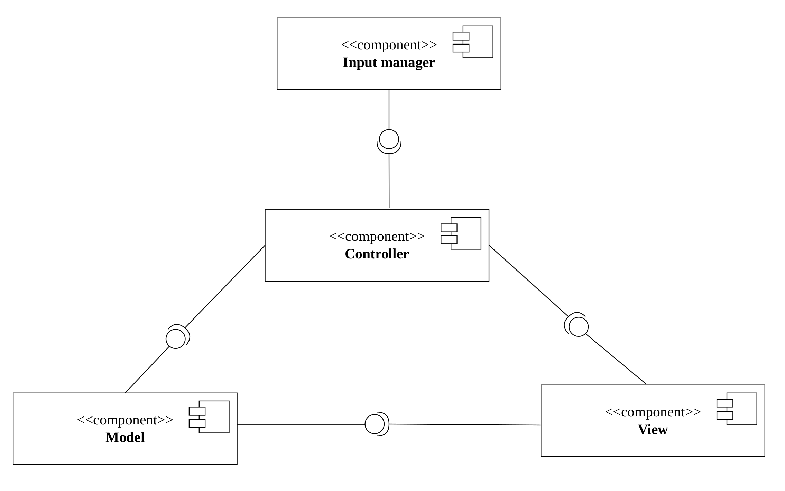
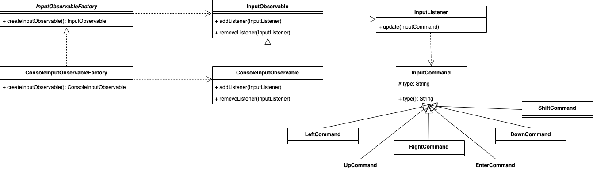
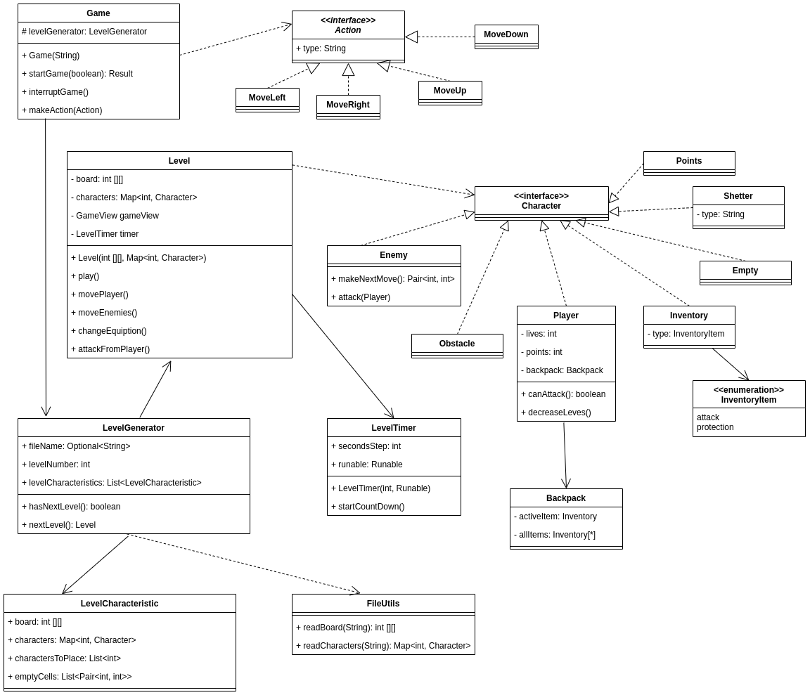
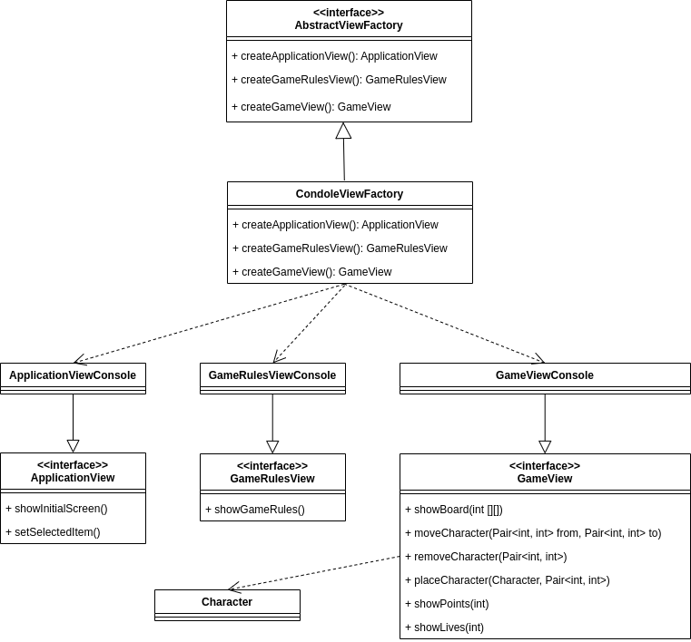
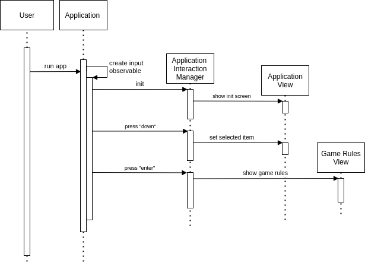
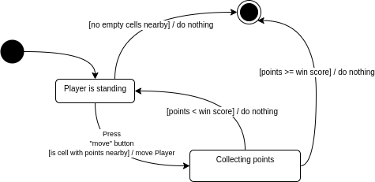

# Design document

## Список разработчиков

- Жемчужина Елизавета
- Кириллова Евгения
- Сунко Елена
- Иценко Екатерина

## Общие сведения о системе
### Назначение

Система представляет из себя реализацию roguelike игры **Escape** с консольной графикой. Система предназначена для развлечения и отдыха.

### Границы системы
- Поддерживается только однопользовательский оффлайн режим игры
- Консольная графика
- Управление производится с клавиатуры заранее заданными клавишами
- Предусмотрено главное меню с тремя опциями:

  - Начать игру (_play_)
  - Начать игру с загрузкой уровней из файла (_play_with_levels_from_config_files_)
  - Выйти из игры (_exit_)
  - Посмотреть подсказки по управлению (_help_)
- Текущая локация (или поле) представляет из себя прямоугольное поле в декартовой системе координат
- Текущее поле отображается на экране целиком
- На начальном этапе случайно генерируется расположение части ресурсов и препятствий для отдельных уровней
- Помимо игрового поля на экране отображаются панели с ресурсами, здоровьем и инвентарем
- Отсутствуют контрольные точки (сохранения)

#### Правила игры
Задача игрока - пройти все уровни. Уровней 5, если они сгенерированы приложением, и неограниченное количество, если пользователь предоставляет их самостоятельно.

Каждому уровню соответствует одна локация, представляющая из себя прямоугольное поле. В клетке поля может находиться:
- Препятствие: игрок ступить на данную клетку не может.
- Враг: в случае, если игрок оказывается в окрестности врага (то есть на одну клетку справа, снизу, сверху или по диагонали), враг атакует игрока. Урон зависит от типа врага:
  - Враг первого типа: двигается всегда только по диагонали или вертикали, его траектория всегда одна и та же. Наносит меньший урон.
  - Враг второго типа: двигается случайным образом, наносит больший урон.
- Очки
- Инвентарь:
  - Инвентарь атаки: когда на игроке надет данный инвентарь, игрок может убирать препятствия (но не врагов).
  - Инвентарь защиты: когда на игроке надет данный инвентарь, урон от врагов становится меньше.
- Укрытие: у каждого укрытия есть определенный цвет. Укрытия одного цвета соответствуют одному типу.
  - Настоящее укрытие: при нахождении на клетке данного укрытия игрок находится в безопасности (враг не может его атаковать)
  - Ложное урытие: при наступление на клетку игрок теряет жизнь

Уровень считается пройденным, как только игрок набирает нужное число очков. На прохождение каждого уровня выделяется определенное число секунд, если игрок не успел собрать все очки до истечения таймера, он автоматически проиграл.

У игрока есть заданное в начале игры число жизней, которое по тем или иным причинам может уменьшаться в течение игры. Когда число жизней становится равно 0, игрок автоматически проигрывает.

Для передвижения персонажа игрок должен использовать стрелки left, up, right, down. Кнопка enter при наличии инвентаря атаки позволяет атаковать препятствия в окрестности игрока (если их несколько, то сразу все). Кнопка shift позволяет переключаться между инвентарем.
### Контекст

- Приложение не поддерживает взаимодействие с сервером
- Приложение адаптировано под Linux, MacOS и Windows

## Architectural drivers
### Технические ограничения
Должна быть предусмотрена библиотека для работы с консолью, работающая под упомянутыми операционными системами.

### Бизнес-ограничения

- Срок разработки ограничен несколькими месяцами
- В силу отсутствия бюджета, используются бесплатные фреймворки и библиотеки

### Качественные характеристики системы

- Система должна быть достаточно гибкой для дальнейшей расширяемости, то есть необходимость в изменении установленных границ при добавлении или модификации сущностей отсутствует. Например, должна быть возможность добавления новых персонажей
- Платформозависимые части системы необходимо выделять в отдельные компоненты
- В дальнейшем планируется сделать проект open source, поэтому простота сопровождаемости системы превалирует над производительностью
- В системе не происходит взаимодействия с личными данными пользователей, поэтому обеспечение безопасности не является приоритетной задачей
- При генерации и отрисовке уровней используются простые инструменты (такие как консольная графика), поэтому обеспечение высокой производительности не требуется

### Ключевые функциональные требования

- Управление производится с клавиатуры
- Игрок управляет одним персонажем
- Персонаж взаимодействует с полем и объектами на нем (ресурсы, инвентарь и пр.)
- Имеется возможность подгружать карту текущей локации из файла
- Консольная графика

## Architectural views
### Роли и случаи использования

#### Роли
- Игрок
- Программист, дорабатывающий проект после перехода в стадию open source

#### Случаи использования
- Игрок хочет максимально разнообразным количеством способов пройти игру, поэтому количество вариантов взаимодействия игрока с внутриигровыми объектами должно быть большим
- Игрок не хочет находиться в одной локации долго, поэтому уровни должны быть короткими
- Среднестатистический игрок не обладает средствами на покупку игрового компьютера, поэтому простота графики приветствуется
- Программист не хочет разбираться во всем коде целиком, поэтому система должна быть спроектирована так, чтобы взаимодействие велось только с точками расширения проекта

#### Типичный пользователь

Это Райан.

Он прекрасен, поэтому его возраст не так важен (но вообще ему 41).

Он не является заядлым геймером, поэтому ему хочется, чтобы управление было максимально простым.

Его хобби - это работа в консоли, но иногда он устает от бесконечного изучения MAN'ов и ему хочется разнообразия.

### Композиция

Используется классическая слоистая архитектура, основной акцент сделан на выделение компонент в соответствии
с архитектурным стилем **MVC**, но для обработки ввода была выделена отдельная компонента

#### Описания компонент:

- **Input manager** отвечает за получение пользовательского ввода и перенаправляет его в **Controller**
- **Controller** отвечает за связь между собой остальных компонентов: обрабатывает ввод от пользователя,
  передает полученные команды на выполнение в **Model** или во **View**
- **Model** реализует логику игры: перемещает объекты на поле, реализует их взаимодействие друг с другом
- **View** отвечает за графическое отображение игры

### Логическая структура

#### Input manager
Отвечает за получение, обработку и перенаправление пользовательского ввода.
##### abstract class InputObservableFactory
Абстрактная фабрика для создания наследников интерфейса `InputObservable`.
При необходимости добавить новый источник ввода пользователю достаточно определить нового наследника для нее.

**Методы**:

- `createInputObservable(): InputObservable`

**Реализация**:
- **class ConsoleInputObservableFactory** - создает элемент типа `ConsoleInputObservable`

##### interface InputObservable
Интерфейс, определяющий методы для добавления, удаления и оповещения наблюдателей;

**Методы**:
+ `addListener(InputListener)` - добавление наблюдателя
+ `removeListener(InputListener)` - удаление наблюдателя

**Реализация**:
- **class ConsoleInputObservable**

##### interface InputListener
Интерфейс, определяющий метод для получения оповещений.

**Методы**:
+ `update(InputCommand)` - оповещение наблюдателя о введении команды

**Реализация**:
- **class ApplicationInteractionManager**
- **class GameInteractionManager**

##### abstract class InputCommand
Описывает команду, введенную пользователем.

**Методы**:
+ `type(): String` - возвращает тип команды.

**Реализация**:
- **class LeftCommand**
- **class UpCommand**
- **class RightCommand**
- **class DownCommand**
- **class EnterCommand**
- **class ShiftCommand**
##### Диаграмма:

#### Controller
Связь между компонентами и обработка комманд пользователя.
##### class Application

Точка входа в приложение и начала игры.

**Методы**:

+ `startApplication(String)` - начинает работу приложения. На вход принимает путь до директории с конфигурационными файлами, описывающими уровни игры.

+ `startGame(boolean)` - начинает игру. На вход принимает `true` в случае, если необходимо генерировать уровни по конфигурационным файлам, предоставленными пользователем, и `false` в ином случае.

+ `exit()` - завершает работу приложения.

Внутри себя создает `InputObservable` с помощью `InputObservableFactory`, чтобы следить за пользовательскими действиями в приложении.

##### class ApplicationInteractionManager
Реализует интерфейс `InputListener`. Следит за действиями пользователя в приложении и должным образом реагирует.
Зона ответственности включает в себя все действия пользователя вне самого игрового процесса, то есть
действия на начальном экране (запрос на начало игры, запрос вывода правил, запрос на выход из приложения),
а так же на экране с правилами игры.

**Поля**:

- `applicationView: ApplicationView` - необходим для отрисовки первоначального экрана и выделение опций на нем.

- `gameRulesView: ApplicationView` - необходим для отрисовки правил игры.

- `application: Application` - необходим для передачи управления для начала игрового процесса, а так же выхода из приложения.

- `selectedItem: SelectedItem` - выделенная опций, на которой пользователь "стоит" в текущий момент.

**Методы**:

+ `update: InputCommand` - данный метод вызывается каждый раз при введении пользователем той
или иной команды (по сути нажатием той или иной клавиши). В зависимости от команды и текущей выделенной
опции может показать правила игры, осуществить выход из приложения, начать игру, выделить другую опцию.

##### class GameInteractionManager
Реализует интерфейс `InputListener`. Следит за действиями пользователя в момент самой игры и должным образом реагирует.
Зона ответственности включает в себя все действия пользователя только в момент самого игрового процесса.

**Методы**:

+ `update: InputCommand` - данный метод вызывается каждый раз при введении пользователем той
или иной команды (по сути нажатием той или иной клавиши). Введенная команда преобразуется в наследника
класса `Action`, который затем передается в метод класса `Game`. Таким образом добавляется новый уровень абстракции между нажатыми в действительности
клавишами и теми действиями, которые в них заложены.
Например, часто за передвижение игрока помимо стрелок также отвечают клавиши WASD. В таком случае
нажатие на клавишу W и на верхнюю стрелку переводится в единый класс `MoveUp`, являющийся наследником `Action`.

##### enumeration SelectedItem
Опции главного экрана, одна из которых выделена в любой момент времени.

##### abstract class Action
Отвечает за некоторое действие, совершенное в игре игроком.
Наследники: `Attack`, `MoveLeft`, `MoveRight`, `MoveUp`, `MoveDown`, `ChangeEquiption`.

##### Диаграмма:

#### Model

Реализация основной логики игры

##### interface Action

Возможное действие игрока на поле

**Поля**:

  - `String type` - тип действия

**Реализации**:

- `Attack`
- `MoveLeft`
- `MobeRight`
- `MoveUp`
- `MoveDown`
- `ChangeEquiption`

##### enum Result

**Элементы**:

- `victory`
- `defeat`

##### class Game

Запускает игру, выполняет смену уровней в ней

**Поля**:

- `LevelGenerator levelGenerator` - используется для генерации нового уровня
- `Level currentLevel` - текущий уровень, на котором находится игрок

**Конструкторы**:

- `Game(String levelFilesPath)` - принимает директорию, в которой расположены файлы, созданные пользователем
для генерации уровней. В случае, если директория пользователем не задана, `levelFilespath = ""`

**Методы**:

- `Result startGame(boolean generateLevelsFromFile)` - функция запуска игры. Пока игрок не дошел до конца или не проиграл на каком-то
из уровней, создает новый уровень, по завершению предыдущего. В конце возвращает результат игры
- `void makeAction(Action)` - выполняет поступившее на вход действие, вызвав нужный метод у `currentLevel`

##### enum InventoryItem

**Элементы**:
  - `attack` - дает игроку возможность ломать препятствия
  - `protection` - уменьшает урон от атаки врага

##### class Backpack

Рюкзак персонажа

**Поля**:
- `activeItem` - инвентарь, которым на данный момент пользуется игрок. В случае, если игрок ничем не пользуется, `activeItem = null`
- `List<Inventory> allItems` - список вещей, которые есть у игрока

##### interface Character

Интерфейс, описывающий объект, находящийся на полеEmpty

**Реализации**:

- **class Player**: враг, раз в какое-то время двигается и атакует игрока

  Методы: 
  - `Pair<int, int> makeNextMove()` - возвращает координаты, на которые должен передвинуться
  - `void attack(Player)` - атакует игрока
- **class Player**: игрок, управляется пользователем
  
  Поля:
  - `int lives` - оставшееся количество жизней
  - `int points` - собранное количество очков
  - `Backpack backpack` - рюкзак игрока

  Методы:
  - `boolean canAttack()` - если у игрока в рюкзаке есть инвентарь, увеличивающий силу удара, возвращает `true`, иначе `false`
  - `void decreaseLives()` - при атаке уменьшает количество жизней, в зависимости от содержимого рюкзака может уменьшать на разное число
- **class Obstacle**: препятствие на поле, может быть разрушено игроком при наличии нужного инвентаря в рюкзаке
- **class Points**: очки, которые нужно собирать игроку для того, чтобы выиграть
- **class Shetter**: убежище, в котором может прятаться игрок от атак врагов

  Поля:
  - `String type` - тип убежища
- **class Empty**: пустая клетка поля
- **class Inventory**: инвентарь

  Поля:
  - `InventoryItem type` - тип инвентаря

##### abstract class LevelCharacteristic

Класс для предоставления информации о том, что должно быть на рандомно сгенерированном уровне

**Поля**:

- `int[][] board` - поле уровня, некоторые объекты на котором заранее расставлены
- `Map<int, Character> characters` - отображение из `id` в объект, который должен быть на поле
- `List<int> charactersToPlace` - объекты, которые должны быть рандомно расположены при генерации уровня
- `List<Pair<int, int>> emptyCells` - список еще не занятых клеток, в которые можно помещать объекты при рандомной генерации

**Наследники**:

- **class FirstLevelCharacteristic**
- **class SecondLevelCharacteristic**
- **class ThirdLevelCharacteristic**
- **class FourthLevelCharacteristic**
- **class FifthLevelCharacteristic**

##### class FileUtils

Класс для работы с файлами

**Методы**:

- `int [][] readBoard(String fileName)` - получает из файла двумерных массив, в клетках которого записаны
`id` объектов, которые там находятся
- `Map<int, Character> readCharacters(String fileName)` - получает из файла отображение из `id` в объект на поле

##### class LevelGenerator

Генерирует уровни рандомно или из файла

**Поля**:

- `Optional<String> filesPath` - директория в которой лежат файлы для генерации уровней
- `int levelNumber` - номер уровня, который надо сгенерировать
- `List<LevelCharacteristics> levelCharacteristics` - список заданных параметров для уровней, 
если генерация будет происходить рандомно

**Методы**:

- `boolean hasNextLevel()` - если уровни генерируются рандомно, то проверяет, сгенерировано ли на данный момент
меньше 5 уровней, если да, то возвращает `true`, иначе `false`. Если уровни генерируются из файлов пользователей, то
проверяет, что есть еще не использованные файлы
- `Level nextLevel()` - генерирует следующий уровень. В случае, если уровень генерируется из файла, использует `FileUtils`

##### class LevelTimer

Совершает действия на поле один раз в некоторый промежуток времени

**Поля**:

- `int secondsStep` - промежуток времени, раз в который необходимо совершать действие

- `Runable runable`
**Методы**:

- `void startCountDown()` - запускает таймер и раз в `secondsStep` секунд вызывает метод `run` у `runable`

##### class Level

Реализует взаимодействия объектов на одном уровне

**Поля**:

- `int[][] board` - поле. Каждый элемент массива - `id` объекта, который находится в клетке с данными координатами
- `Map<int, Character> characters` - все объекты, которые есть на поле
- `GameView gameView` - объект для отрисовки на экране изменений на поле
- `LevelTimer levelTimer` - запускает передвижение врагов раз в определенное количество секунд

**Методы**:

- `void Play()` - запускает внутри себя `levelTimer`, отвечает за передвижение на поле объектов, не контролируемых пользователем
- `void movePlayer()` - передвижение игрока на поле
- `void moveEnemies()` - передвижение врагов на поле
- `void changeEquiption()` - изменение элемента инвентаря, который использует игрок
- `void attackFromPlayer()` - атака игроком препятствия

#### View
Графическое отображение игры
##### interface ApplicationView

Отвечает за отображение главного экрана игры.

**Методы**:
- `void showInitialScreen()` - отрисовывает экран, на котором есть следующие опции: `start game`, `start game with levels from file`,
  `show rules`, `exit`. Опция, которую выбирает игрок, выделена. Изначально выделена опция `start game`
- `void setSelectedItem` - изменяет выделенную опцию

**Реализация**:
- **class ApplicationViewConsole** - отображает все в консоли

##### interface GameRulesView

Отвечает за отображение экрана с правилами игры

**Методы**:
- `void showGameRules()` - отрисовывает экран, на котором выведены текстом правила игры

**Реализация**:
- **class GameRulesViewConsole** - отображает все в консоли

##### interface GameView

Отвечает за отображение самой игры

**Методы**:
- `void showBoard(int[][] board)` - выводит поле со всеми расположенными на нем объектами
- `void moveCharacter(Pair<int, int> from, Pair<int, int> to)` - клетку поля с координатами `from` отрисовывает пустой, а
  персонажа, который был на этом месте, отрисовывает в клетке с координатами `to`
- `void removeCharacter(Pair<int, int> from)` - отображает клетку с координатами `from` пустой
- `void placeCharacter(Character character, Pair<int, int> to)` - отображает в клетке с координатами `to` символ, соответствующий
  типу `character`
- `void showPoints(int points)` - отображает количество очков у персонажа.
- `void showLives(int lives)` - отображает сколько у персонажа осталось жизней
- `void showBackpack(Backpack bacpack)` - отображает рюкзак персонажа в следующем формате: предмет представлен в виде строчки
с названием этого предмета, кроме того есть строчка `nothing`, если игрок не подобрал пока ни одного предмета то
 в отображении рюкзака будет только она. Предмет, используемый игроком, выделен.
- `void setItemInBackpack()` - меняет выделенный предмет в рюкзаке

**Реализация**:
- **class GameViewConsole** - отображает все в консоли

##### interface AbstractViewFactory

Объявляет методы для создания различных абстрактных объектов типов `ApplicationView`, `GameRulesView`, `GameView`.
Введение данной фабрики добавляет гибкости в архитектуру, так как позволяет добавлять новые форматы отображения (например, по-разному отображать персонажей).
В случае, если придется изменить вывод, то достаточно будет создать другую реализацию
абстрактной фабрики.

**Методы**:
- `ApplicationView createApplicationView()`
- `GameRulesView createGameRulesView()`
- `GameView createGameView()`

**Реализация**:
- **class ConsoleViewFactory** - создает элементы типов `ApplicationViewConsole`, `GameRulesViewConsole` и `GameViewConsole`

##### Диаграмма:

### Взаимодействия и состояния

#### Диаграмма последовательностей:

На диаграмме представлена реализация сценария выбора опции **show rules** в главном меню игры и последующий вывод правил на экран.

#### Диаграмма конечных автоматов:

На диаграмме представлена реализация сценария сбора очков игроком.

## Обоснование принятых решений:

### Архитектура:

Архитектурный стиль MVC был выбран, так как в нем четко и удобно разделена логика приложения, отдельная компонента для 
обработки ввода пользователя была выделена для достижения большей платформонезависимости остальных компонент

### Библиотека для графического отображения:

На данный момент мы рассматриваем два варианта, у каждого имеются преимущества, окончательный выбор мы сделаем когда 
начнем реализацию проекта

1. [Swing](https://docs.oracle.com/javase/tutorial/uiswing/)

Плюсы:

- часть JDK, не нужно ставить дополнительных библиотек
- есть туториалы и форумы с ответами на вопросы
- встроенный редактор форм почти во всех средах разработки
- поддержка различных стилей

Минусы:
- окно с множеством компонентов начинает подтормаживать
- сложная работа с менеджерами компоновки

2. [JavaFX](https://www.oracle.com/java/technologies/javase/javafx-overview.html)

Плюсы:
- быстрая работа за счет графического конвейера
- множество различных компонентов
- поддержка стилей
- утилиты для создания установщика программы
- приложение можно запускать как десктопное и в браузере как часть страницы

Минусы:
- фреймворк еще разрабатывается, иногда можно поймать баги
- JavaFX пока не очень широко распространен

