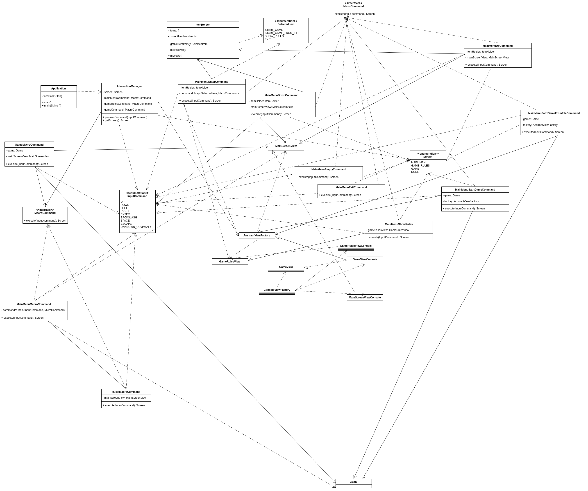
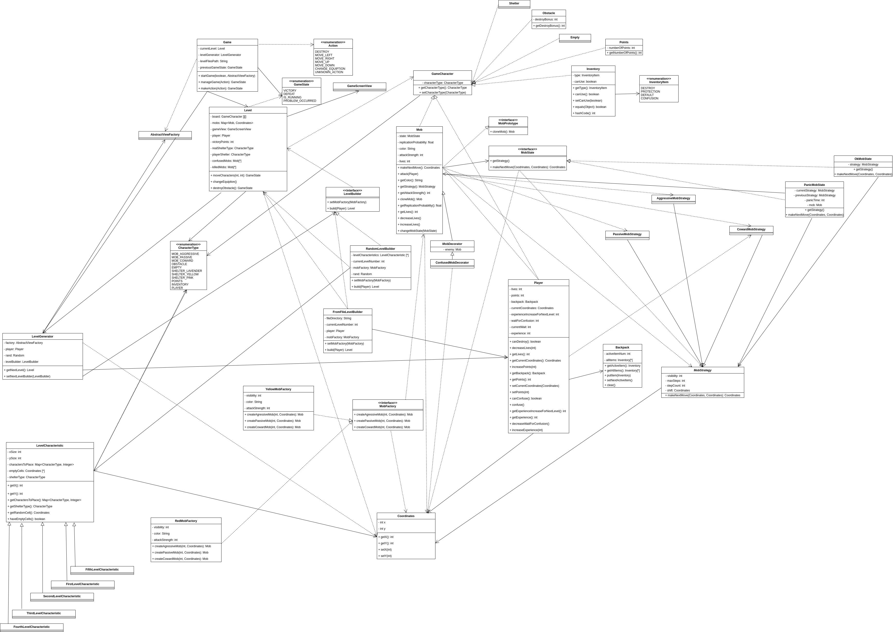

# Design document

## Список разработчиков

- Жемчужина Елизавета
- Кириллова Евгения
- Сунко Елена
- Иценко Екатерина

## Общие сведения о системе

### Назначение

Система представляет из себя реализацию roguelike игры **Escape** с консольной графикой. Система предназначена для
развлечения и отдыха.

### Границы системы

- Поддерживается только однопользовательский оффлайн режим игры
- Консольная графика

#### Правила игры

Задача игрока - пройти все уровни игры. Уровней 5, если они сгенерированы приложением, и неограниченное количество, если
пользователь предоставляет их самостоятельно.

Каждому уровню соответствует одна локация, представляющая из себя прямоугольное поле. В клетке поля может находиться:

- Препятствие - игрок ступить на данную клетку не может.
- Враг - в случае, если игрок оказывается в окрестности врага (то есть на одну клетку справа, слева, снизу или сверху),
  происходит битва между игроком и врагом. Если игрок вводит врага в состояние конфузии, то враг начинает временно
  ходить рандомно (состояние проходит спустя пять шагов).
    - Агрессивный враг: ходит по вертикали/горизонтали, если в окресности нет игрока, иначе начинает его преследовать.
    - Пассивный враг: стоит на месте вне зависимости от нахождения игрока.
    - Трусливый враг: ходит по вертикали/горизонтали, если в окресности нет игрока, иначе начинает убегать от него.
- Очки
- Инвентарь:
    - Инвентарь атаки - когда на игроке надет данный инвентарь, игрок может убирать препятствия и атаковать врагов.
    - Инвентарь защиты - когда на игроке надет данный инвентарь, урон от врагов становится меньше.
- Укрытие - у каждого укрытия есть определенный цвет. Укрытия одного цвета соответствуют одному типу.
    - Настоящее укрытие - при нахождении на клетке данного укрытия игрок находится в безопасности (враг не может его
      атаковать)
    - Ложное урытие - наступление на такое укрытие равносильно наступлению на пустую клетку, от атак врагов оно не
      спасает

Confusion: игрок может вводить врага в состояние конфузии, если он находится рядом со врагом и соответствующий инвентарь
выбран в качестве активного. Должно пройти несколько ходов прежде чем игрок сможет заново ввести врага в состояние
конфузии.

Игрок получает очки опыта, когда убивает врагов. При наборе определенного числа очков опыта игрок переходит на следующий
уровень (персонажа), что означает улучшение его характеристики: число жизней, а так же число ходов между возможностью
использовать инвентарь конфузии заново.

Уровень (игры) считается пройденным, как только игрок набирает нужное число очков.

У игрока есть заданное в начале игры число жизней, которое по тем или иным причинам может уменьшаться в течение игры.
Когда число жизней становится равно 0, игрок автоматически проигрывает.

Для передвижения персонажа игрок должен использовать стрелки `left`, `up`, `right`, `down`. Кнопка `space` при наличии
инвентаря атаки позволяет атаковать препятствия в окрестности игрока (если их несколько, то сразу все). Кнопка `/ `
позволяет переключаться между инвентарем.

### Контекст

- Приложение не поддерживает взаимодействие с сервером
- Приложение адаптировано под Linux, MacOS и Windows

## Architectural drivers

### Технические ограничения

Должна быть предусмотрена библиотека для работы с консолью, работающая под упомянутыми операционными системами.

### Бизнес-ограничения

- Срок разработки ограничен несколькими месяцами
- В силу отсутствия бюджета, используются бесплатные фреймворки и библиотеки

### Качественные характеристики системы

- Система должна быть достаточно гибкой для дальнейшей расширяемости, то есть необходимость в изменении установленных
  границ при добавлении или модификации сущностей отсутствует. Например, должна быть возможность добавления новых
  персонажей
- Платформозависимые части системы необходимо выделять в отдельные компоненты
- В дальнейшем планируется сделать проект open source, поэтому простота сопровождаемости системы превалирует над
  производительностью
- В системе не происходит взаимодействия с личными данными пользователей, поэтому обеспечение безопасности не является
  приоритетной задачей
- При генерации и отрисовке уровней используются простые инструменты (такие как консольная графика), поэтому обеспечение
  высокой производительности не требуется

### Ключевые функциональные требования

- Игрок управляет одним персонажем
- Управление производится с клавиатуры заранее заданными клавишами
- Персонаж взаимодействует с полем и объектами на нем (ресурсы, инвентарь и пр.)
- Имеется возможность подгружать карту текущей локации из файла
- Текущая локация (или поле) представляет из себя прямоугольное поле в декартовой системе координат
- Текущее поле отображается на экране целиком
- На начальном этапе случайно генерируется расположение части ресурсов и препятствий для отдельных уровней
- Помимо игрового поля на экране отображаются панели с ресурсами, здоровьем и инвентарем
- Отсутствуют контрольные точки (сохранения)
- Предусмотрено главное меню с тремя опциями:

    - Начать игру (_play_)
    - Начать игру с загрузкой уровней из файла (_play_with_levels_from_config_files_)
    - Выйти из игры (_exit_)
    - Посмотреть подсказки по управлению (_help_)

## Architectural views

### Роли и случаи использования

#### Роли

- Игрок
- Программист, дорабатывающий проект после перехода в стадию open source

#### Случаи использования

- Игрок хочет максимально разнообразным количеством способов пройти игру, поэтому количество вариантов взаимодействия
  игрока с внутриигровыми объектами должно быть большим
- Игрок не хочет находиться в одной локации долго, поэтому уровни должны быть короткими
- Среднестатистический игрок не обладает средствами на покупку игрового компьютера, поэтому простота графики
  приветствуется
- Программист не хочет разбираться во всем коде целиком, поэтому система должна быть спроектирована так, чтобы
  взаимодействие велось только с точками расширения проекта

#### Типичный пользователь

Это Райан.

Он прекрасен, поэтому его возраст не так важен (но вообще ему 41).

Он не является заядлым геймером, поэтому ему хочется, чтобы управление было максимально простым.

Его хобби - это работа в консоли, но иногда он устает от бесконечного изучения MAN'ов и ему хочется, помимо простого
разнообразия, расшевелить извилины после монотонной работы. Отсюда - заинтересованность в быстрой смене уровней и
продвинутой системе механик.

### Композиция

Используется классическая слоистая архитектура, основной акцент сделан на выделение компонент в соответствии с
архитектурным стилем **MVC**

#### Описаниe:

**Controller**:

- `input component` - отвечает за обработку пользователя
- `interaction component` - отвечает за связь с остальными подсистемами

**Model**:

- `characterManager component` - отвечает за все связанное с игроками
- `levelManager component` - отвечает за все связанное с уровнями
- `gameManager component` - отвечает за связь уровней и в целом за всю игру

**View**

- `ApplicationView component` - отрисовка главного меню
- `GameRulesView component` - отрисовка правил
- `GameView component` - отрисовка самой игры

### Логическая структура

#### Controller

Связь между компонентами и обработка команд пользователя.

##### class Application

Точка входа в приложение и начала игры.

**Поля**:

-`String filesPath` - путь до директории с конфигурационными файлами, описывающими уровни игры. По умолчанию - ` "" `.

**Конструкторы**:

- `Application()`
- `Application(String filesPath)`

**Методы**:

- `void start()` - начинает работу приложения. Внутри создается цикл, в котором при помощи средств библиотеки для работы
  с графикой считывается ввод пользователя. Далее этот ввод передается в `InteractionManager`.
- `void main(String[] args)` - точка входа.

##### class ItemHolder

Хранит опции игрового меню.

**Поля**:

- `List<SelectedItem> items` - список всех доступных опций
- `int currentItemNumber` - индекс текущей опции в списке

**Методы**:

- `SelectedItem getCurrentItem()` - возвращает текущую опцию
- `void moveDown()` - осуществляет сдвиг на нижний элемент меню
- `void moveUp()` - осуществляет сдвиг на верхний элемент меню

##### class InteractionManager

Зона ответственности включает в себя все действия пользователя, то есть действия на начальном экране (запрос на начало
игры, запрос вывода правил, запрос на выход из приложения), а так же на экране с правилами игры и во время игрового
процесса.

**Поля**:

- `Screen screen` - текущее состояние (экран) приложения
- `MacroCommand mainMenuCommand` - команда для взаимодействия с главным меню
- `MacroCommand gameRulesCommand` - команда для взаимодействия с правилами игры
- `MacroCommand gameCommand` - команда для взаимодействия с игровым полем

**Конструкторы**:

- `InteractionManager(String filesPath, AbstractViewFactory factory)`
- `InteractionManager(AbstractViewFactory factory, Game game)`

**Методы**:

- `void processCommand(InputCommand command)` - данный метод вызывается каждый раз при введении пользователем той или
  иной команды (по сути нажатием той или иной клавиши). В зависимости от команды и текущей выделенной опции может
  показать правила игры, осуществить выход из приложения, начать игру, выделить другую опцию, повлиять на ход игрока.
- `Screen getScreen()` - возвращает текущее состояние (экран) приложения

##### enum SelectedItem

Опции главного меню, одна из которых выделена в любой момент времени.

**Элементы**:

- `START_GAME`
- `START_GAME_FROM_FILE`
- `SHOW_RULES`
- `EXIT`

##### enum InputCommand

Поддерживаемые клавиши.

**Элементы**:

- `UP`
- `DOWN`
- `LEFT`
- `RIGHT`
- `ENTER`
- `BACKSLASH`
- `SPACE`
- `ESCAPE`
- `UNKNOWN_COMMAND`

##### enum Screen

Игровые экраны (состояния).

**Элементы**:

- `MAIN_MENU`
- `GAME_RULES`
- `GAME`
- `NONE`

##### interface MacroCommand

Интерфейс для команд со сложной логикой, отвечающих за отображение игровых экранов.

**Методы**:

- `Screen execute(InputCommand inputCommand)` - запускает соответствующую команду

##### class GameMacroCommand

Класс, описывающий взаимодействие с игровым полем. Реализует интерфейс _MacroCommand_

**Поля**:

- `Game game` - сама игра
- `MainScreenView mainScreenView` - отображение главного меню

**Конструкторы**:

- `GameMacroCommand(Game game, MainScreenView mainScreenView)`

**Методы** - такие же, как в _MacroCommand_

##### class MainMenuMacroCommand

Класс, описывающий взаимодействие с игровым меню. Реализует интерфейс _MacroCommand_

**Поля**:

- `Map<InputCommand, MicroCommand> commands` - соответствие команд из ввода и простых команд контроллера

**Конструкторы**:

- `MainMenuMacroCommand(MainScreenView mainScreenView, Game game, AbstractViewFactory factory, GameRulesScreenView gameRulesView)`

**Методы** - такие же, как в _MacroCommand_

##### class RulesMacroCommand

Класс, описывающий взаимодействие с правилами игры. Реализует интерфейс _MacroCommand_

**Поля**:

- `MainScreenView mainScreenView` - отображение главного меню

**Конструкторы**:

- `RulesMacroCommand(MainScreenView mainScreenView)`

**Методы** - такие же, как в _MacroCommand_

##### interface MicroCommand

Интерфейс для команд с простой логикой, отвечающих за отображение игровых экранов.

**Методы**:

- `Screen execute(InputCommand inputCommand)` - запускает соответствующую команду

##### class MainMenuUpCommand

Класс, описывающий сдвиг на верхний элемент игрового меню. Реализует интерфейс _MicroCommand_

**Поля**:

- `ItemHolder itemHolder` - элементы меню
- `MainScreenView mainScreenView` - отображение главного меню

**Конструкторы**:

- `MainMenuUpCommand(ItemHolder itemHolder, MainScreenView mainScreenView)`

**Методы** - такие же, как в _MicroCommand_

##### class MainMenuStartGameFromFileCommand

Класс, описывающий опцию "старт игры из файла" (с т.з. отображения). Реализует интерфейс _MicroCommand_

**Поля**:

- `Game game` - сама игра
- `AbstractViewFactory factory` - фабрика отображений

**Конструкторы**:

- `MainMenuStartGameFromFileCommand(Game game, AbstractViewFactory factory)`

**Методы** - такие же, как в _MicroCommand_

##### class MainMenuStartGameCommand

Класс, описывающий опцию "старт игры" (с т.з. отображения). Реализует интерфейс _MicroCommand_

**Поля**:

- `Game game` - сама игра
- `AbstractViewFactory factory` - фабрика отображений

**Конструкторы**:

- `MainMenuStartGameCommand(Game game, AbstractViewFactory factory)`

**Методы** - такие же, как в _MicroCommand_

##### class MainMenuShowRulesCommand

Класс, описывающий опцию "правила игры" (с т.з. отображения). Реализует интерфейс _MicroCommand_

**Поля**:

- `GameRulesScreenView gameRulesView` - отображение правил игры

**Конструкторы**:

- `MainMenuShowRulesCommand(GameRulesScreenView gameRulesView)`

**Методы** - такие же, как в _MicroCommand_

##### class MainMenuExitCommand

Класс, описывающий опцию "выход из игры" (с т.з. отображения). Реализует интерфейс _MicroCommand_

**Методы** - такие же, как в _MicroCommand_

##### class MainMenuEnterCommand

Класс, описывающий команду "enter" в главном меню (с т.з. отображения). Реализует интерфейс _MicroCommand_

**Поля**:

- `ItemHolder itemHolder` - элементы главного меню
- `Map<SelectedItem, MicroCommand> command` - соответствие выбранного элемента и команд с простой логикой из контроллера

**Конструкторы**:

- `MainMenuEnterCommand(Game game, AbstractViewFactory factory, ItemHolder itemHolder, GameRulesScreenView gameRulesView)`

**Методы** - такие же, как в _MicroCommand_

##### class MainMenuEmptyCommand

Класс, описывающий ситуацию, когда игра не идет (с т.з. отображения). Реализует интерфейс _MicroCommand_

**Методы** - такие же, как в _MicroCommand_

##### class MainMenuDownCommand

Класс, описывающий сдвиг на нижний элемент игрового меню. Реализует интерфейс _MicroCommand_

**Поля**:

- `ItemHolder itemHolder` - элементы меню
- `MainScreenView mainScreenView` - отображение главного меню

**Конструкторы**:

- `MainMenuDownCommand(ItemHolder itemHolder, MainScreenView mainScreenView)`

**Методы** - такие же, как в _MicroCommand_

##### Диаграмма:

#### Model

Реализация основной логики игры.

##### enum Action

Возможное действие игрока на поле.

**Элементы**:

- `DESTROY`
- `MOVE_LEFT`
- `MOVE_RIGHT`
- `MOVE_UP`
- `MOVE_DOWN`
- `CHANGE_EQUIPTION`
- `UNKNOWN_ACTION`

##### enum GameState

Возможное состояние игры.

**Элементы**:

- `VICTORY`
- `DEFEAT`
- `IS_RUNNING`
- `PROBLEM_OCCURRED`

##### class Game

Запускает игру, выполняет смену уровней в ней.

**Поля**:

- `LevelGenerator levelGenerator` - используется для генерации нового уровня
- `Level currentLevel` - текущий уровень, на котором находится игрок
- `String levelFilesPath` - путь до конфигурационных файлов
- `GameState previousGameState` - последнее запомненное состояние игры

**Конструкторы**:

- `Game(String levelFilesPath)` - принимает директорию, в которой расположены файлы, созданные пользователем для
  генерации уровней. В случае, если директория пользователем не задана, `levelFilespath = ""`

**Методы**:

- `void startGame(boolean generateLevelsFromFile, AbstractViewFactory factory)` - функция запуска игры. Пока игрок не
  дошел до конца или не проиграл на каком-то из уровней, создает новый уровень, по завершению предыдущего
- `GameState manageGame(Action action)` - выполняет поступившее на вход действие, запускает новый уровень, если это
  необходимо. Возвращает текущее состояние игры
- `GameState makeAction(Action action)` - выполняет поступившее на вход действие, вызвав нужный метод у `currentLevel`.
  Возвращает текущее состояние игры

##### enum InventoryItem

Возможные типы инвентаря.

**Элементы**:

- `DESTROY` - дает игроку возможность ломать препятствия
- `PROTECTION` - уменьшает урон от атаки врага
- `DEFAULT` - дефолтный (нейтральный) вариант
- `CONFUSION` - дает возможность вводить врага в состояние конфузии

##### class Backpack

Рюкзак персонажа.

**Поля**:

- `int activeItemNum` - номер (в общем списке) инвентаря, которым на данный момент пользуется игрок. В случае, если
  игрок ничем не пользуется, `activeItemNum = 0`, а тип элемента - `DEFAULT`
- `List<Inventory> allItems` - список вещей, которые есть у игрока

**Конструкторы**:

- `Backpack()`

**Методы**:

- `Inventory getActiveItem()` - возвращает предмет, которым игрок пользуется на данный момент
- `List<Inventory> getAllItems()` - возвращает список всех предметов в рюкзаке
- `void putItem(Inventory item)` - кладет предмет в рюкзак
- `void setNextActiveItem()` - меняет используемый элемент на следующий из списка предметов в рюкзаке
- `void clear()` - очищает рюкзак
- `void makeUnusable(InventoryItem inventoryItem)` - делает предмет из рюкзака недоступным к использованию
- `void makeUsable(InventoryItem inventoryItem)` - делает предмет из рюкзака доступным к использованию

##### abstract class GameCharacter

Абстрактный класс, описывающий объект, находящийся на игровом поле.

**Поля**:

- `CharacterType characterType` - тип игрового объекта

**Конструкторы**:

- `GameCharacter(CharacterType characterType)`

**Методы**:

- `CharacterType getCharacterType()` - возвращает тип игрового объекта
- `void setCharacterType(CharacterType characterType)` - меняет тип игрового объекта на переданный

**Реализации**:

- **class Mob**: моб, двигается определенным образом и атакует игрока, если он рядом. Реализует интерфейс _
  MobPrototype_.

  **Поля**:

    - `MobState state` - состояние, хранит в себе информацию о поведении моба
    - `float replicationProbability` - вероятность репликации новых мобов
    - `String color` - цвет моба
    - `int attackStrength` - сила атаки
    - `int lives` - количество жизней

  **Конструкторы**:

    - `Enemy(CharacterType characterType, int visibility, int maxSteps, Coordinates shift)`
    - `Enemy(CharacterType characterType, MobStrategy strategy)`

  **Методы**:

    - `Coordinates makeNextMove()` - возвращает сдвиг координаты, на которые должен передвинуться моб
    - `void attack(Player player)` - атакует игрока
    - `MobState getState()` - возвращает состояние
    - `String getColor()` - возвращает цвет моба
    - `int getAttackStrength()` - возвращает силу атаки
    - `float getReplicationProbability()` - возвращает вероятность репликации новых мобов
    - `Mob cloneMob()` - клонирует моба (текущего)
    - `int getLives()` - возвращает количество жизней
    - `void decreaseLives()` - уменьшает количество жизней
    - `void increaseLives()` - увеличивает количество жизней
    - `void changeMobState(MobState newState)` - меняет состояние моба на переданное

- **class Player**: игрок, управляется пользователем.

  **Поля**:

    - `int lives` - оставшееся количество жизней
    - `int points` - собранное количество очков
    - `Coordinates currentCoordinates` - текущие координаты
    - `Backpack backpack` - рюкзак игрока
    - `int experienceIncreaseForNextLevel` - количество очков опыта, необходимых для перехода на следующий уровень
    - `int waitForConfusion` - число шагов прежде чем инвентарь _CONFUSION_ можно использовать снова
    - `int currentWait` - сколько шагов с последнего использования _CONFUSION_ уже прошло
    - `int experience` - число очков опыта

  **Конструкторы**:

    - `Player(int lives, int experience)`
    - `Player(int lives, Coordinates coordinates)`

  **Методы**:

    - `int getLives()` - возвращает число жизней игрока
    - `Coordinates getCurrentCoordinates()` - возвращает текущие координаты
    - `void increasePoints(int points)` - увеличивает очки игрока на переданное число
    - `Backpack getBackpack()` - возвращает рюкзак игрока
    - `int getPoints()` - возвращает число набранных очков
    - `void setCurrentCoordinates(Coordinates currentCoordinates)` - меняет текущие координаты на переданные
    - `void setPoints(int points)` - меняет число очков на переданное
    - `boolean canDestroy()` - если у игрока в рюкзаке есть инвентарь, увеличивающий силу удара, возвращает `true`,
      иначе `false`
    - `void decreaseLives(int delta)` - при атаке уменьшает количество жизней на переданное число
    - `boolean canConfuse()` - если игрок может ввести моба в состояние конфузии, вернет _true_, иначе _false_
    - `void confuse()` - вводит моба в состояние конфузии
    - `int getExperienceIncreaseForNextLevel()` - возвращает число очков опыта, необходимое для перехода на следующую
      ступень (с т.з. опыта)
    - `int getExperience()` - возвращает число очков опыта
    - `void decreaseWaitForConfusion()` - уменьшает ожидание до следующего использования конфузии
    - `void increaseExperience(int delta)` - увеличивает текущее количество очков опыта на _delta_

- **class Obstacle**: препятствие на поле, может быть разрушено игроком при наличии нужного инвентаря в рюкзаке.

  **Поля**:

    - `int destroyBonus` - бонус, который достается игроку при разрушении препятствия

  **Конструкторы**:

    - `public Obstacle()`
    - `public Obstacle(int destroyBonus)`

  **Методы**:

    - `int getDestroyBonus()` - возвращает бонус за разрушение

- **class Points**: очки, которые нужно собирать игроку для того, чтобы выиграть.

  **Поля**:

    - `int numberOfPoints` - само количество очков

  **Конструкторы**:

    - `Points(int numberOfPoints)`

  **Методы**:

    - `int getNumberOfPoints()` - возвращает количество очков

- **class Shelter**: убежище, в котором может прятаться игрок от атак врагов

  **Конструкторы**:
    - `Shelter(CharacterType characterType)`

- **class Empty**: пустая клетка поля.

  **Конструкторы**:

    - `Empty()`

- **class Inventory**: инвентарь.

  **Поля**:

    - `InventoryItem type` - тип инвентаря
    - `boolean canUse` - может ли инвентарь использоваться

  **Конструкторы**:

    - `Inventory(InventoryItem type)`

  **Методы**:

    - `InventoryItem getType()` - возвращает тип инвентаря
    - `boolean canUse()` - _true_ если инвентарь может использоваться, _false_ иначе
    - `void setCanUse(boolean canUse)` - меняет значение флага `canUse` на переданное
    - `boolean equals(Object o)` - проверка двух объектов из инвентаря на равенство
    - `int hashCode()` - подсчет хешей

##### interface MobPrototype

Прототип для персонажа-моба.

**Методы**:

- `Mob cloneMob()` - клонирует моба (текущего)

##### enum CharacterType

Описывает типы игровых объектов на поле.

**Элементы**:

- `MOB_AGGRESSIVE`
- `MOB_PASSIVE`,
- `MOB_COWARD`,
- `OBSTACLE`
- `EMPTY`
- `SHELTER_LAVENDER`
- `SHELTER_YELLOW`
- `SHELTER_PINK`
- `POINTS`
- `INVENTORY`
- `PLAYER`

##### abstract class LevelCharacteristic

Абстрактный класс для предоставления информации о том, что должно быть на рандомно сгенерированном уровне.

**Поля**:

- `int xSize, int ySize` - размеры доски
- `Map<CharacterType, Integer> charactersToPlace` - информация о том сколько объектов какого типа должно быть на поле
- `List<Coordinates> emptyCells` - список еще не занятых клеток, в которые можно помещать объекты при рандомной
  генерации
- `CharacterType shelterType` - тип укрытия

**Конструкторы**:

- `LevelCharacteristic(int xSize, int ySize, CharacterType shelterType, Map<CharacterType, Integer> charactersToPlace)`

**Методы**:

- `int getX(), int getY()` - возвращают координаты по соответствующим осям
- `Map<CharacterType, Integer> getCharactersToPlace()` - объекты, которые необходимо разместить на игровом поле
- `CharacterType getShelterType()` - возвращает тип укрытия
- `Coordinates getRandomCell()` - удаляет случайную пустую клетку поля из общего списка, связывая ее с игровым объектом
- `boolean haveEmptyCells()` - _true_ если есть пустые клетки, _false_ иначе

**Наследники**:

- **class FirstLevelCharacteristic**
- **class SecondLevelCharacteristic**
- **class ThirdLevelCharacteristic**
- **class FourthLevelCharacteristic**
- **class FifthLevelCharacteristic**

Классы выше содержат характеристики каждого уровня соответственно.

##### interface LevelBuilder

Интерфейс для "построения" уровней.

**Методы**:

- `void setMobFactory(MobFactory mobFactory)` - меняет значение `mobFactory` на переданное
- `Level build(Player player)` - "строит" новый уровень с переданным игроком

##### FromFileLevelBuilder

"Строит" уровень, используя информацию из конфига.

**Поля**:

- `String fileDirectory` - директория с конфигом
- `int currentLevelNumber` - номер текущего уровня
- `Player player` - игрок
- `MobFactory mobFactory` - фабрика мобов, генерящихся на данном уровне

**Конструкторы**:

- `FromFileLevelBuilder(String fileDirectory)`

**Методы** - такие же, как в _LevelBuilder_

##### RandomLevelBuilder

"Строит" уровень, генерируя объекты рандомно.

**Поля**:

- `List<LevelCharacteristic> levelCharacteristics` - список характеристик уровней
- `int currentLevelNumber` - номер текущего уровня
- `MobFactory mobFactory` - фабрика мобов, генерящихся на данном уровне
- `Random rand` - рандом :)

**Методы** - такие же, как в _LevelBuilder_

##### class LevelGenerator

Генерирует уровни рандомно или из файла, дёргая методы у _levelBuilder_.

**Поля**:

- `AbstractViewFactory factory` - фабрика для _view_
- `Player player` - игрок
- `Random rand` - рандом :)
- `LevelBuilder levelBuilder` - "строитель" уровня

**Конструкторы**:

- `LevelGenerator(AbstractViewFactory factory)`

**Методы**:

- `Level getNextLevel()` - генерирует следующий уровень
- `void setLevelBuilder(LevelBuilder levelBuilder)` - меняет "строитель" уровней на переданный

##### class Level

Реализует взаимодействия объектов на одном уровне.

**Поля**:

- `GameCharacter[][] board` - поле. В клетке находится текущий `GameCharacter`
- `Map<Mob, Coordinates> mobs` - мобы, которые есть на поле
- `GameScreenView gameView` - объект для отрисовки на экране изменений на поле
- `Player player` - игрок
- `int victoryPoints` - количество очков, необходимое для победы на текущем уровне
- `CharacterType realShelterType` - тип убежища, валидный на данном уровне
- `CharacterType playerShelter` - тип убежища, в котором прячестся игрок
- `List<Mob> confusedMobs` - мобы в состоянии конфузии
- `List<Mob> killedMobs` - убитые мобы

_Примечание_: на каждом уровне является валидным ("работающим") только определенный тип убежища.

**Конструкторы**:

- `Level(GameCharacter[][] board, GameScreenView gameView, Player player, Map<Mob, Coordinates> mobs, CharacterType realShelterType, int victoryPoints)`

**Методы**:

- `GameScreenView getGameView()` - возвращает _gameView_
- `GameCharacter[][] getBoard()` - возвращает игровую доску
- `void setGameView(GameScreenView gameView)` - меняет _gameView_ на переданную
- `GameState moveCharacters(int dx, int dy)` - передвижение игрока на поле и мобов (мобы делают шаг на каждый ход
  игрока) на переданную дельту. Возвращает текущее состояние игры
- `void changeEquiption()` - изменение элемента инвентаря, который использует игрок
- `GameState destroyObstacle()` - разрушение игроком препятствия. Возвращает текущее состояние игры

##### class Coordinates

Координаты объекта на поле.

**Поля**:

- `int x, int y` - координаты по соответствующим осям

**Конструкторы**:

- `Coordinates(int x, int y)`

**Методы**:

- `int getX(), int getY()` - возвращают координаты по соответствующим осям
- `void setX(int x), void setY(int y)` - изменяют координаты по соответствующим осям на переданные значения

##### abstract class MobStrategy

Абстрактный класс для предоставления алгоритма передвижения моба.

**Поля**:

- `int visibility` - определяет, в каких пределах игрок будет виден для моба.
- `int maxSteps` - сколько шагов по вертикали или горизонтали максимум может сделать моб.
- `int stepCount` - сколько шагов уже было сделано в текущем направлении.
- `Coordinates shift` - в каком направлении ходит моб в обычном состоянии.

**Конструкторы**:

- `MobStrategy(int visibility, int maxSteps, Coordinates shift)`
- `MobStrategy()`

**Методы**:

- `Coordinates makeNextMove(Coordinates mobCoordinates, Coordinates playerCoordinates)` - рассчитать сдвиг координат
  моба в зависимости от местоположения игрока

**Наследники**:

- **class AggressiveMobStrategy**
- **class PassiveMobStrategy**
- **class CowardMobStrategy**

##### abstract class MobDecorator

Абстрактный класc, позволяющий декорировать класс моба.

**Поля**:

- `Mob mob` - объект моба, запросы к которому будут переадресовываться при необходимости.

**Конструкторы**:

- `MobDecorator(Mob mob)`

**Наследники**:

- **class ConfusedMobDecorator**

##### interface MobFactory

Интерфейс фабрики для создания мобов с разными стратегиями поведения.

**Методы**:

- `Mob createAggressiveEnemy(int maxSteps, Coordinates shift)` - создает агрессивного моба
- `Mob createPassiveEnemy(int maxSteps, Coordinates shift)` - создает пассивного моба
- `Mob createCowardEnemy(int maxSteps, Coordinates shift)` - создает трусливого моба

##### class RedEnemyFactory

Фабрика для создания красных мобов с разными стратегиями поведения.

**Поля**:

- `int visibility` - видимость
- `String color` - цвет
- `int attackStrength` - сила атаки

**Методы** - такие же, как в _MobFactory_

##### class YellowEnemyFactory

Фабрика для создания красных мобов с разными стратегиями поведения.

**Поля**:

- `int visibility` - видимость
- `String color` - цвет
- `int attackStrength` - сила атаки

**Методы** - такие же, как в _MobFactory_

##### interface MobState

Интерфейс, содержащий описание поведения мобов и отвечающий за их передвижение.

**Методы**:

- `MobStrategy getStrategy()` - возвращает стратегию моба
- `Coordinates makeNextMove(Coordinates mobCoordinates, Coordinates playerCoordinates)` - совершает следующий шаг

##### class OkMobState

Класс, описывающий состояние моба "все ок".

**Поля**:

- `MobStrategy strategy` - стратегия моба

**Конструкторы**:

- `OkMobState(MobStrategy strategy)` - возвращает стратегию моба

**Методы** - такие же, как в _MobState_

##### class PanicMobState

Класс, описывающий паническое состояние моба.

**Поля**:

- `MobStrategy previousStrategy` - предыдущая стратегия моба
- `MobStrategy currentStrategy` - нынешняя стратегия
- `int panicTime` - время паники
- `Mob mob` - моб

**Конструкторы**:

- `PanicMobState(MobStrategy strategy)` - возвращает стратегию моба

**Методы** - такие же, как в _MobState_

#### View

Графическое отображение игры.

##### interface MainScreenView

Отвечает за отображение главного меню игры.

**Методы**:

- `void showMainScreen()` - отрисовывает экран, на котором есть следующие опции: _start game_
  , _start game with levels from file_, _show rules_, _exit_. Опция, которую выбирает игрок, выделена. Изначально
  выделена опция _start game_
- `void setSelectedItem(SelectedItem item)` - изменяет выделенную опцию

**Реализация - class MainScreenViewConsole**: отображает все в консоли.

**Поля**:

- `Terminal terminal` - терминал
- `TextGraphics textGraphics` - текст, который необходимо вывести
- `Map<SelectedItem, GraphicItem> itemToGraphics` - соответствие между пунктом меню и его графическим отображением
- `SelectedItem currentItem` - выбранный пункт меню

**Конструкторы**:

- `MainScreenViewConsole(Terminal terminal)`

##### interface GameRulesScreenView

Отвечает за отображение экрана с правилами игры.

**Методы**:

- `void showGameRules()` - отрисовывает экран, на котором выведены текстом правила игры

**Реализация - class GameRulesViewConsole**: отображает все в консоли.

**Поля**:

- `Terminal terminal` - терминал
- `TextGraphics textGraphics` - текст, который необходимо вывести

**Конструкторы**:

- `GameRulesScreenViewConsole(Terminal terminal)`

##### interface GameScreenView

Отвечает за отображение самой игры.

**Методы**:

- `void showBoard(GameCharacter[][] board)` - выводит поле со всеми расположенными на нем объектами
- `void moveCharacter(int xFrom, int yFrom, int xTo, int yTo)` - клетку поля с координатами _from_ отрисовывает пустой,
  а персонажа, который был на этом месте, отрисовывает в клетке с координатами _to_
- `void removeCharacter(int x, int y)` - отображает клетку с координатами _from_ пустой
- `void placeCharacter(GameCharacter character, int x, int y)` - отображает в клетке с координатами _to_ символ,
  соответствующий типу _character_
- `void showPoints(int currentPoints, int totalPoints)` - отображает количество очков у персонажа и общее число очков
- `void showLives(int lives)` - отображает сколько у персонажа осталось жизней
- `void showBackpack(Backpack backpack)` - отображает рюкзак персонажа в следующем формате: предмет представлен в виде
  строчки с названием этого предмета, кроме того есть строчка _nothing_, если игрок не подобрал пока ни одного предмета
  то в отображении рюкзака будет только она. Предмет, используемый игроком, выделен.
- `void setMessage(String message)` - вывод переданного сообщения на экран
- `void removeMessage()` - удаление сообщения
- `showExperience(int currentExperience, int totalExperience)` - вывод очков опыта на экран

**Реализация - class GameScreenViewConsole**: отображает все в консоли.

**Поля**:

- `Terminal terminal` - терминал
- `TextGraphics textGraphics` - текст, который необходимо вывести
- `GameCharacter[][] board` - игровое поле
- `RGB ChineseWhite` - белый
- `RGB LightYellow` - желтый
- `RGB Lavender` - лавандовый
- `RGB White` - белый

##### abstract class AbstractViewFactory

Объявляет методы для создания различных абстрактных объектов типов `MainScreenView`, `GameRulesScreenView`
, `GameScreenView`. Введение данной фабрики добавляет гибкости в архитектуру, так как позволяет добавлять новые форматы
отображения (например, по-разному отображать персонажей). В случае, если придется изменить вывод, то достаточно будет
создать другую реализацию абстрактной фабрики.

**Методы**:

- `MainScreenView createMainScreenView()`
- `GameScreenView createGameScreenView()`
- `GameRulesScreenView createGameRulesScreenView()`

**Реализация - class ConsoleViewFactory**: создает элементы типов `MainScreenViewConsole`, `GameRulesScreenViewConsole`
и `GameScreenViewConsole`.

**Поля**:

- `Terminal terminal` - терминал

**Конструкторы**:

-`ConsoleViewFactory(Terminal terminal)`

##### Диаграмма:

### Взаимодействия и состояния

#### Диаграмма последовательностей:

На диаграмме представлена реализация сценария выбора опции **show rules** в главном меню игры и последующий вывод правил
на экран.

#### Диаграмма конечных автоматов:

На диаграмме представлена реализация сценария сбора очков игроком.

## Обоснование принятых решений:

### Архитектура:

Архитектурный стиль MVC был выбран, так как в нем четко и удобно разделена логика приложения, отдельная компонента для
обработки ввода пользователя была выделена для достижения большей платформонезависимости остальных компонент

### Библиотека для графического отображения:

В итоге была выбрана библиотека [lanterna](https://github.com/mabe02/lanterna).

Во-первых, она оказалась достаточно простой в использовании, варианты рассматриваемые ранее показались нам слишком
сложные для игры с консольной графикой.

Во-вторых, с помощью средств данной библиотеки оказалось возможным разделить логику ввода и отрисовки.

